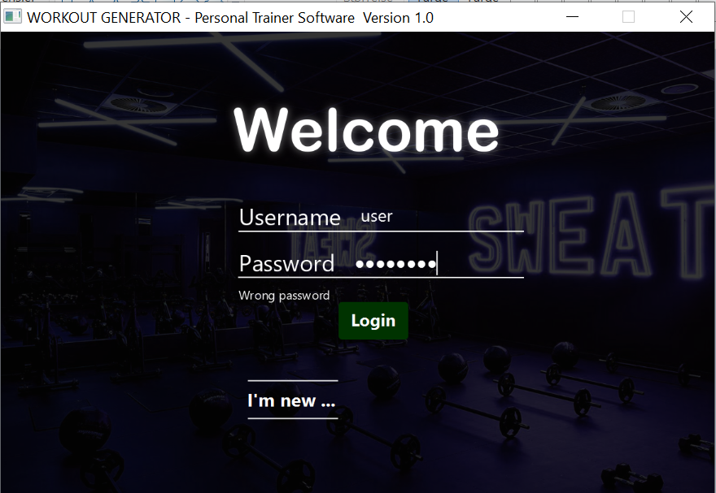
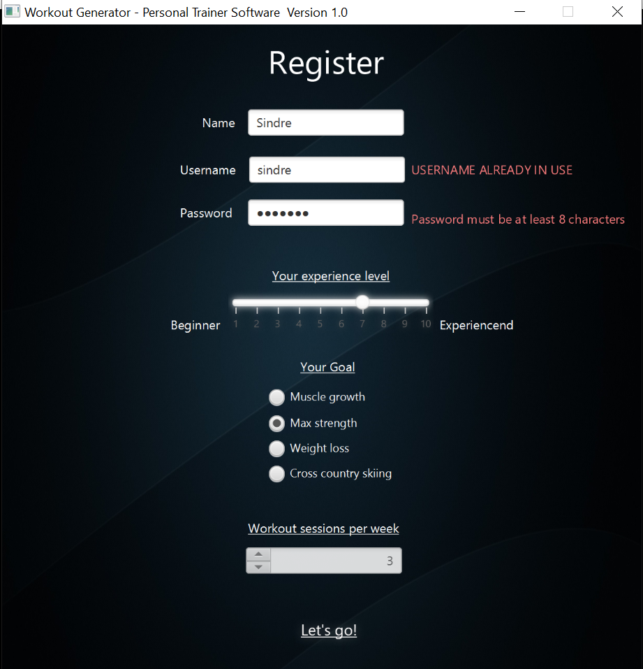
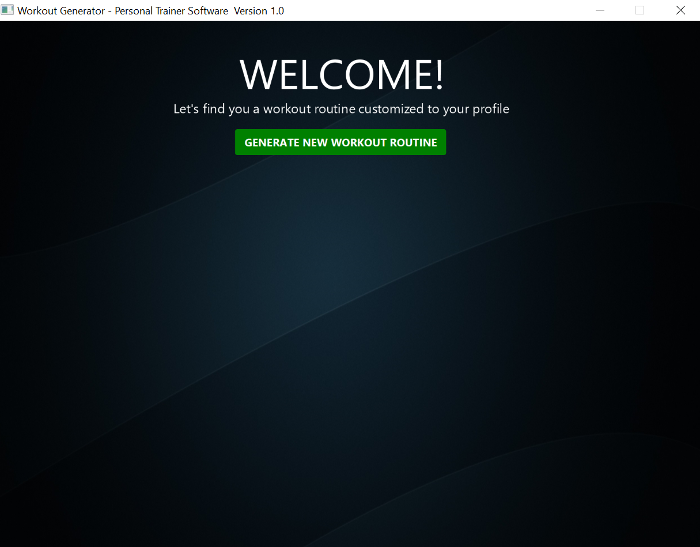
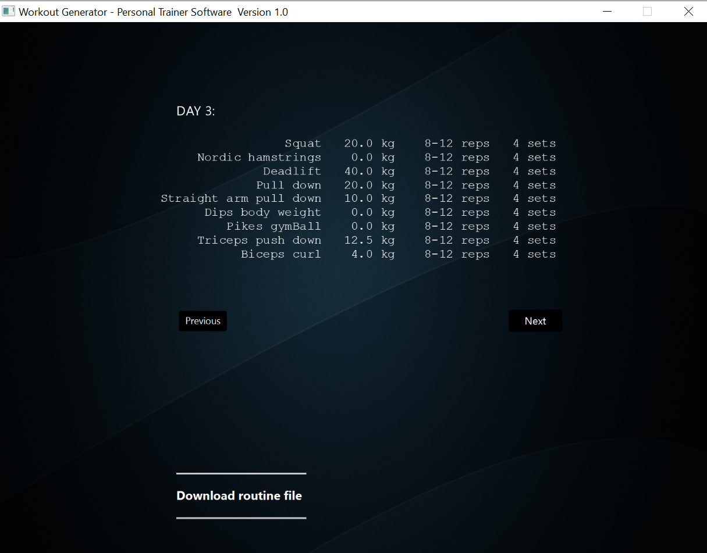
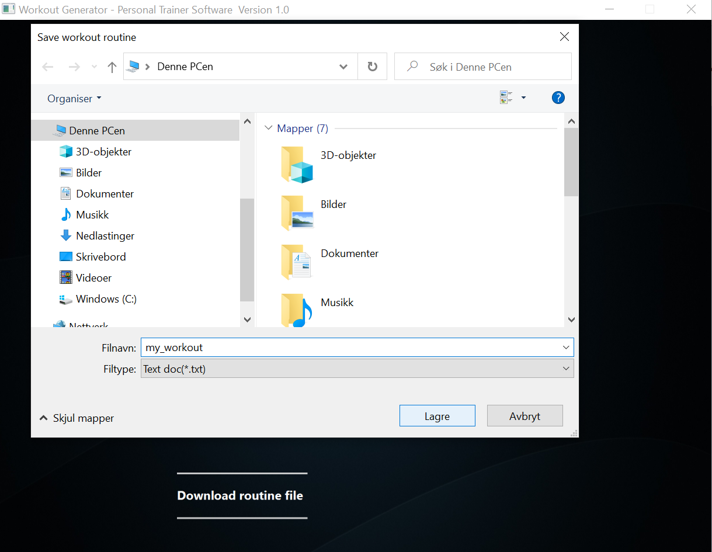
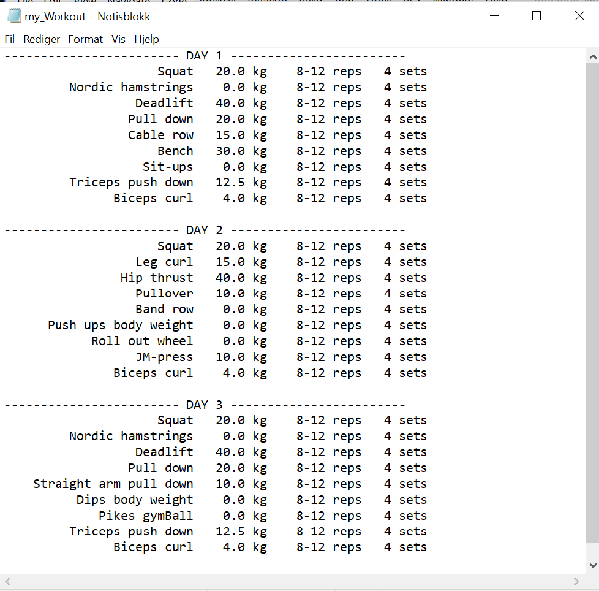

# Workout-Generator
Executable jar file without database:
<a id="raw-url" href="https://raw.githubusercontent.com/godager/Workout-Generator/master/WorkoutGeneratorDemo.jar">DOWNLOAD DEMO</a>

Generates strength training workout routines based on user input. User login information and exercises are stored in a local database.
To use the software with database you have to set up a PostgreSQL database by running the SQL scripts from the directory "SQLCreate&InsertScripts".

# Screenshots of the user interface

