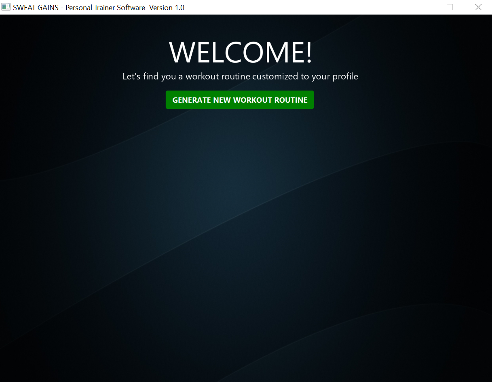
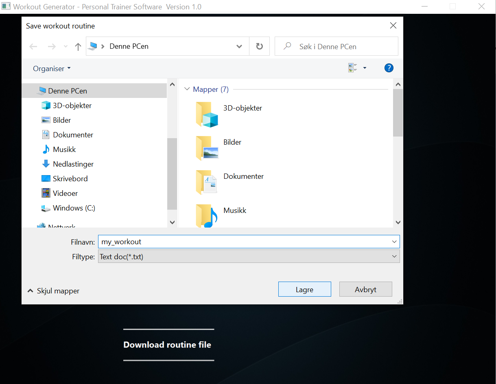

# Workout-Generator
Generates strength training workout routines based on user input. Users and exercises are stored in i local database.
To use the software you have to set up a postgresql database by running the sql scripts from the directory "SQLCreate&InsertScripts".

Demo without database will be uploaded soon.

# Screenshots of the user interface

